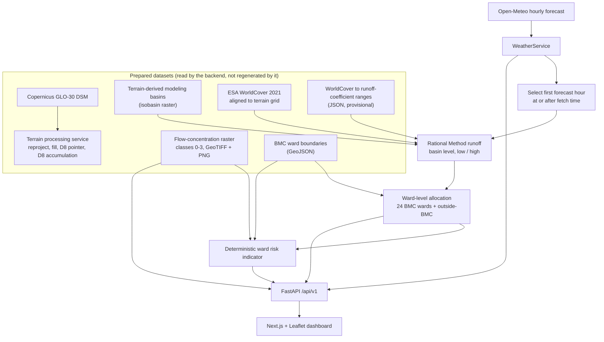

# NeerDrishti — Urban Flood Nowcasting System

Smart India Hackathon 2026 · Problem Statement SIH26085 (Urban Flood Nowcasting System: Drainage and Rainfall Coupling) · Theme: Disaster Management · Team NEXUS

**Status:** research prototype for the Mumbai (BMC) pilot area. Outputs are provisional model indicators. They are not operational flood warnings. See [Limitations](#17-limitations-and-current-scope).

*Naming note:* some backend identifiers, docstrings and service names use the earlier working name "FlowSight". They refer to this project.

---

## 2. Problem statement

Urban flooding in Mumbai results from the interaction of intense rainfall, terrain, land cover (how much water becomes runoff) and drainage conditions. Rainfall-only warnings do not show where runoff concentrates. The problem statement asks for rainfall and drainage information to be coupled.

This prototype addresses one part of that problem: coupling **forecast rainfall** with **terrain- and land-cover-derived runoff** at ward scale, and showing where terrain concentrates flow. It does **not** model the drainage network, drainage capacity or flood depth (see Limitations).

## 3. Project overview

NeerDrishti is a FastAPI backend with a Next.js dashboard. The backend:

1. Fetches an hourly precipitation forecast for Mumbai from Open-Meteo.
2. Selects the first forecast hour at or after the time the forecast was fetched.
3. Uses that hour's precipitation as a rainfall intensity in a Rational Method calculation over terrain-derived modeling basins, with runoff coefficients derived from ESA WorldCover.
4. Allocates basin runoff to the 24 BMC administrative wards.
5. Combines ward runoff with a terrain-derived flow-concentration raster into a deterministic ward-level indicator (LOW / MODERATE / HIGH / VERY_HIGH).
6. Serves the results, with provenance, through a REST API to a dashboard containing a Leaflet map.

The pipeline is **forecast-driven**. It is not a radar-based nowcast, and it contains no machine-learning model.

## 4. Current implemented capabilities

| Area | Capability | Location |
|---|---|---|
| Terrain processing | Raster validation, reprojection to EPSG:32643 (GDAL `gdalwarp`), depression filling, D8 flow-direction pointer, D8 flow accumulation (WhiteboxTools), slope (GDAL `gdaldem`, Horn), per-product provenance JSON | `backend/app/services/processing_service.py` |
| Data layer | CRS inspection and normalization (pyproj), raster reading (rasterio), raster validators, metadata records | `backend/app/data/` |
| Weather | Async Open-Meteo client: current conditions plus hourly forecast, input validation, timeout and upstream-error handling | `backend/app/services/weather_service.py` |
| Runoff | Rational Method engine (`Q = C × i × A`) | `backend/app/services/runoff/engine.py` |
| Basin runoff | Low/high runoff over terrain-derived modeling basins using WorldCover-derived coefficient ranges | `backend/app/services/runoff/basin_service.py` |
| Ward runoff | Allocation of basin runoff to 24 BMC wards by raster-cell overlap, plus an explicit outside-BMC remainder | `backend/app/services/runoff/ward_service.py` |
| Forecast coupling | Selects one hourly forecast entry and passes it to the basin runoff service | `backend/app/services/runoff/forecast_coupling_service.py` |
| Flow concentration | Reads and validates a precomputed, percentile-classified D8 flow-accumulation raster; serves summary statistics and a PNG | `backend/app/services/flow_concentration_service.py` |
| Risk indicator | Deterministic per-ward indicator from forecast runoff and flow-concentration coverage | `backend/app/services/flood_risk_service.py` |
| API | FastAPI, versioned under `/api/v1`, typed Pydantic schemas, consistent error mapping | `backend/app/api/v1/`, `backend/app/schemas/` |
| Dashboard | Next.js (App Router) and React dashboard with a Leaflet map of BMC wards | `frontend/` |

Terrain processing is exposed as a synchronous API call (`POST /api/v1/processing/terrain`). The runoff, ward and flow-concentration services read **prepared datasets** and do not regenerate them (see [Data sources](#7-data-sources)).

## 5. System architecture



Code is layered as endpoint → service → data/provider. Domain models (`app/models`) are separate from API schemas (`app/schemas`). Services accept injected collaborators, so most tests run with fakes and no network access.

## 6. Technology stack

**Backend, core runtime**

| Layer | Technology | Actual purpose |
|---|---|---|
| Language | Python 3.11 (recommended) | Backend runtime |
| Web framework | FastAPI, Uvicorn | REST API, CORS, automatic OpenAPI docs at `/docs` |
| Validation / config | Pydantic v2, pydantic-settings | Request/response schemas; environment-based settings (`.env`) |
| HTTP client | httpx | Async calls to Open-Meteo |

**Backend, geospatial**

| Technology | Actual purpose |
|---|---|
| Rasterio | Reading rasters and metadata, rasterizing BMC ward polygons, geometry reprojection |
| NumPy | Array operations for raster statistics and per-basin/per-ward aggregation |
| pyproj | CRS inspection, normalization and comparison |
| WhiteboxTools (`whitebox` Python package) | Depression filling, D8 pointer, D8 flow accumulation |
| GDAL command-line tools (system install, not a pip package) | `gdalwarp` (reprojection), `gdaldem` (slope), `gdalinfo` (environment check) |

**Backend, testing/development:** pytest.

**Frontend**

| Technology | Actual purpose |
|---|---|
| Next.js 16 (App Router), React 19, TypeScript (strict) | Dashboard application |
| Tailwind CSS 4 | Styling, plus a small set of CSS keyframe animations in `globals.css` |
| lucide-react | Icons |
| Leaflet, React-Leaflet | Web GIS map: ward polygons, image overlay, legends |
| OpenStreetMap tiles | Base map (public tile server) |
| Native `fetch` | API access (no axios, SWR, React Query or state library) |

Charts are hand-written inline SVG. No charting library is used.

The dependencies are pinned in `backend/requirements.txt` and `frontend/package.json`. Those files are the authoritative list.

## 7. Data sources

| Source | Role in this project | Notes |
|---|---|---|
| **Copernicus GLO-30** | Terrain input to the processing pipeline; the modeling basins and flow-accumulation products derive from it | A **Digital Surface Model (DSM)**. It includes buildings, vegetation and infrastructure. It is not a bare-earth DEM, and at 30 m it is not street-level terrain |
| **ESA WorldCover 2021** | Land-cover classes, aligned to the terrain grid, used to derive provisional runoff coefficients | Permanent water (class 80) is excluded from contributing area |
| **BMC administrative ward boundaries** (`BMC_admin_wards.geojson`) | Ward geometry (`gid`, `name`) for runoff allocation, flow-concentration overlay and map display | Administrative boundaries, **not** drainage catchments. Stored in CRS84 (EPSG:4326 lon/lat) |
| **Open-Meteo hourly forecast API** | Current conditions and hourly precipitation forecast for Mumbai | The application response exposes a provider/model label ("Open-Meteo / ECMWF IFS HRES 9km"), which is a constant in `weather_service.py`. The request does not set Open-Meteo's `models` parameter, so no specific Open-Meteo model is explicitly selected |
| **ERA5-Land** | Used as the source label of a historical rainfall scenario (2024-06-27T07:00, 25.3 mm/h) that is the default parameter set of the ward-runoff client and the reference scenario in the ward-runoff regression tests | Reanalysis, not observation. The dashboard's ward-runoff panel now uses the forecast scenario instead |
| **OpenStreetMap** | Base map tiles in the dashboard | Loaded from the public tile server |

Files the runoff services expect under the data root:

```
data/
├── raw/boundaries/mumbai/BMC_admin_wards.geojson
├── processed/terrain/Copernicus_Mumbai_GLO30_mosaic_flow_concentration_bmc.tif   # analytical raster
├── processed/terrain/Copernicus_Mumbai_GLO30_mosaic_flow_concentration_bmc.png   # visualization
├── processed/landcover/mumbai_worldcover_2021_aligned_full.tif
├── processed/landcover/worldcover_runoff_mapping.json
├── working/Copernicus_Mumbai_GLO30_mosaic_isobasins_1000.tif                    # modeling basins
└── metadata/                                                                     # provenance JSON written by the processing service
```

## 8. Geospatial processing pipeline

`TerrainProcessingService` runs these steps in order. Each output is validated before it is promoted to `data/processed/terrain/`, and the pipeline stops at the first failure.

1. **Input validation.** Readability, CRS, resolution and nodata checks. A full pixel-value scan is optional.
2. **Reprojection** to EPSG:32643 (WGS 84 / UTM zone 43N) with `gdalwarp`, bilinear resampling, written as an uncompressed, tiled GeoTIFF. Compression is off because the WhiteboxTools GeoTIFF reader does not support the floating-point predictor used by DEFLATE on float rasters.
3. **Depression filling** (WhiteboxTools).
4. **Slope** in degrees (`gdaldem`, Horn algorithm), derived from the filled surface. It is generated but not used by the current runoff or risk calculations.
5. **D8 flow-direction pointer** (WhiteboxTools). The output is checked against the exact D8 value set.
6. **D8 flow accumulation** in cells (WhiteboxTools).
7. **Provenance.** A JSON record per product (tool, version, parameters, timings, parent dataset) in `data/metadata/`.

Work happens in a per-run scratch directory and finished products are moved into place, so a half-written raster is never presented as a product.

| CRS | Where used |
|---|---|
| EPSG:32643 | Target CRS of the processing pipeline outputs |
| EPSG:4326 / CRS84 | Raw Copernicus DSM; BMC ward GeoJSON; the flow-concentration PNG overlay bounds on the Leaflet map |

At request time, ward geometries are transformed from CRS84 into the CRS of whichever raster they are overlaid on (read from the raster).

Formats: GeoTIFF for rasters, GeoJSON for ward boundaries, PNG for the flow-concentration visualization.

The modeling-basin raster, the WorldCover alignment, the runoff-coefficient mapping and the flow-concentration raster are prepared datasets. The API reads them and does not regenerate them.

## 9. Hydrological / runoff methodology

The engine (`runoff/engine.py`) implements the Rational Method:

```
Q = C × i × A
```

| Symbol | Meaning | Unit |
|---|---|---|
| Q | Peak discharge | m³/s |
| C | Runoff coefficient (dimensionless, 0 to 1) | — |
| i | Rainfall intensity, converted internally from mm/h to m/s | mm/h |
| A | Contributing area | m² |

The engine validates `i ≥ 0`, `0 ≤ C ≤ 1` and `A > 0`, and never assumes a default coefficient.

**Basin-level calculation** (`basin_service.py`):

- Modeling basins are terrain-derived. They are not municipal drainage catchments.
- A basin is eligible if at least 90% of its cells have a WorldCover class.
- Each WorldCover class has a `[c_min, c_max]` range in `worldcover_runoff_mapping.json`. A basin's **low** and **high** coefficients are the cell-weighted means of `c_min` and `c_max` over its contributing (non-water) cells.
- Q is computed per basin for the low and high coefficient. Results are reported as min / median / mean / max across eligible basins.

**Why the coefficients are provisional.** They are sensitivity ranges assigned per land-cover class. They are not calibrated against observed runoff or discharge. The mapping file's status field (default `provisional`) is carried into every API response as `coefficient_status`.

**Forecast coupling.** `HourlyForecast.precipitation_mm` is the forecast precipitation for a one-hour interval. It is used numerically as mm/h. This equivalence is valid only because the interval is exactly one hour. The API returns this explanation in `precipitation_basis`.

**Ward allocation** (`ward_service.py`). BMC wards are rasterized onto the basin grid. Each basin's runoff is split across wards in proportion to the share of its cells inside each ward. Any remainder is reported as outside-BMC runoff. This is an area allocation, not a routed discharge.

**What this estimates.** Peak discharge under steady uniform rainfall. It does not compute a hydrograph, flood depth, infiltration dynamics, storage, time of concentration or routing.

## 10. Flow concentration

The flow-concentration layer is a precomputed single-band GeoTIFF with these classes:

| Class | Meaning |
|---|---|
| 0 | No data / not classified (transparent in the map overlay) |
| 1 | D8 accumulation below P95 |
| 2 | P95 to below P99 |
| 3 | P99 and above |

Class thresholds are empirical percentiles of D8 flow accumulation within the BMC area. They are stored as GeoTIFF tags (`p95_accumulation_cells`, `p99_accumulation_cells`). The dashboard legend uses P95 = 166 and P99 = 3,861 accumulation cells for the current raster. The service validates that the raster has one band, NoData = 0, classes in {0,1,2,3}, and the required tags.

**It is** a terrain-derived indicator of where surface flow tends to concentrate, based on D8 flow accumulation.

**It is not** an actual drainage network, measured drainage flow, flood depth, inundation extent, or hydraulic capacity.

## 11. Flood-risk indicator

`FloodRiskService` produces a **deterministic heuristic**. It has no machine-learning model and no training data.

**Forecast hour.** The first hourly entry with `timestamp >= weather.fetched_at`. Earlier hours are never used. If none exists, the API returns 503.

**Per-ward signals**

- `runoff_signal` = the ward's high-coefficient runoff divided by the maximum high-coefficient runoff across all wards in the same response.
- `flow_concentration_high_fraction` = fraction of the ward's *classified* cells (classes 1–3) that are class 2.
- `flow_concentration_very_high_fraction` = fraction of the ward's classified cells that are class 3.

Fractions are relative to classified cells, so a ward with a large no-data area is not treated as low-concentration.

**Score**

```
risk_score = 100 × (0.40 × runoff_signal
                  + 0.25 × flow_concentration_high_fraction
                  + 0.35 × flow_concentration_very_high_fraction)
```

| risk_score | risk_level |
|---|---|
| < 25 | LOW |
| 25 to < 50 | MODERATE |
| 50 to < 75 | HIGH |
| ≥ 75 | VERY_HIGH |

The weights are chosen by the developers. They are not fitted or calibrated. Class 3 is weighted above class 2 because it is the rarer, more extreme terrain signal. The API returns the methodology text in `risk_methodology` and `flow_concentration_methodology`.

**Important property.** Rational Method runoff is linear in rainfall intensity, and `runoff_signal` is normalized by the maximum ward value in the same response. The normalization cancels the rainfall intensity. As a result, `risk_score` and `risk_level` rank wards *relative to one another* and **do not increase with forecast rainfall magnitude** (except that zero rainfall gives a zero runoff signal). The absolute runoff values (`runoff_low_m3s`, `runoff_high_m3s`) do scale with rainfall.

**This indicator is:** a prototype combining a terrain-derived concentration signal with a forecast-runoff signal.

**This indicator is not:** a machine-learning model, a calibrated probability, flood depth, inundation extent, or an official municipal flood-risk classification.

## 12. API endpoints

Base URL (local): `http://localhost:8001`. Interactive documentation: `/docs`.

| Method | Path | Purpose |
|---|---|---|
| GET | `/` | API running message |
| GET | `/health` | Unversioned liveness check |
| GET | `/api/v1/system/health` | Versioned liveness check |
| GET | `/api/v1/system/status` | Status including geospatial toolchain availability |
| GET | `/api/v1/terrain` | List terrain products by lifecycle stage |
| GET | `/api/v1/terrain/info` | Structural information for a terrain product |
| POST | `/api/v1/terrain/verify` | Validate a terrain product |
| POST | `/api/v1/processing/terrain` | Run the terrain-processing pipeline (synchronous; can take minutes at city scale) |
| GET | `/api/v1/weather` | Current conditions and hourly forecast (Open-Meteo) |
| GET | `/api/v1/weather/current` | Current conditions |
| GET | `/api/v1/weather/forecast` | Hourly precipitation forecast |
| GET | `/api/v1/runoff/basins` | Basin-level runoff for a supplied rainfall intensity, source and scenario |
| GET | `/api/v1/runoff/wards` | Ward-level runoff allocation for a supplied rainfall scenario |
| GET | `/api/v1/runoff/wards/boundaries` | BMC ward boundaries as GeoJSON |
| GET | `/api/v1/runoff/flow-concentration` | Flow-concentration summary (class counts, P95/P99, provenance) |
| GET | `/api/v1/runoff/flow-concentration/image` | Flow-concentration visualization PNG |
| GET | `/api/v1/runoff/forecast` | Basin runoff for the selected forecast hour |
| GET | `/api/v1/flood-risk` | Ward-level risk indicator for the selected forecast hour |

Weather failures map to 400 (invalid request), 504 (upstream timeout) and 502 (upstream error). Missing forecast hour or missing data files map to 503.

## 13. Dashboard

| Component | Data source | Status |
|---|---|---|
| Rainfall card and rainfall chart | `/api/v1/weather` (hourly forecast) | Backend-connected. Values are forecast, not observed |
| Flow concentration card | `/api/v1/runoff/flow-concentration` | Backend-connected |
| Forecast-driven runoff card | `/api/v1/runoff/forecast` | Backend-connected, labelled PROVISIONAL |
| Ward Runoff Overview | `/api/v1/runoff/forecast`, then `/api/v1/runoff/wards` with that scenario | Backend-connected |
| Ward Flood Risk | `/api/v1/flood-risk` | Backend-connected; 24 wards with score and level |
| Mumbai Flood Intelligence Map | `/api/v1/runoff/wards/boundaries`, `/flow-concentration/image`, `/flood-risk` | Backend-connected. BMC ward polygons coloured by the API's `risk_level`; toggleable flow-concentration overlay; ward selection panel |
| Hero "Real-Time Status" panel, alerts panel, water-level chart, header notifications, sidebar status | Static demo content in `frontend/data/mockData.ts` or hard-coded in components | **Not connected to any data source** |

## 14. Repository structure

```
<repository root>/
├── backend/
│   ├── app/
│   │   ├── main.py                     # FastAPI app, CORS, /health
│   │   ├── api/v1/
│   │   │   ├── router.py
│   │   │   └── endpoints/              # system, terrain, processing, weather, runoff, flood_risk
│   │   ├── core/                       # config, constants, environment checks, logging
│   │   ├── data/                       # CRS, raster loader, validators, metadata, terrain provider
│   │   ├── models/                     # domain models (terrain, processing)
│   │   ├── schemas/                    # API schemas (common, terrain, processing, weather, runoff)
│   │   └── services/
│   │       ├── processing_service.py
│   │       ├── terrain_service.py
│   │       ├── system_service.py
│   │       ├── weather_service.py
│   │       ├── flow_concentration_service.py
│   │       ├── flood_risk_service.py
│   │       ├── rainfall/               # rainfall input handling
│   │       └── runoff/                 # engine, basin_service, ward_service, forecast_coupling_service
│   ├── tests/
│   └── requirements.txt
├── frontend/
│   ├── app/                            # Next.js App Router: page.tsx, layout.tsx, globals.css
│   ├── components/{common,layout,dashboard}/
│   ├── lib/api/                        # weather.ts, wards.ts, runoff.ts
│   ├── lib/weather/                    # adapter.ts
│   ├── data/mockData.ts                # static demo data
│   └── next.config.ts
├── data/                               # prepared datasets (layout in section 7)
└── README.md
```

## 15. Setup / local development

**Prerequisites:** Python 3.11 (recommended; the code uses syntax that requires Python 3.10 or newer), Node.js and npm, and the GDAL command-line tools (`gdalwarp`, `gdaldem`, `gdalinfo`) installed through your platform's package manager. The prepared datasets from section 7 must be present under the data root for the runoff, ward, flow-concentration and flood-risk endpoints.

**Backend**

```bash
cd backend
python3.11 -m venv .venv
source .venv/bin/activate
pip install -r requirements.txt
uvicorn app.main:app --host 0.0.0.0 --port 8001 --reload
```

Check it is running:

```bash
curl http://localhost:8001/health
curl http://localhost:8001/api/v1/flood-risk
```

The backend needs internet access for weather requests. Optional settings go in `backend/.env`: `CORS_ORIGINS`, `WEATHER_API_BASE_URL`, `WEATHER_DEFAULT_LATITUDE`, `WEATHER_DEFAULT_LONGITUDE`, `WEATHER_DEFAULT_TIMEZONE`, `WEATHER_REQUEST_TIMEOUT_SECONDS`. The default CORS list allows only `http://localhost:3000` and `http://127.0.0.1:3000`.

**Frontend**

```bash
cd frontend
npm install
npm run dev
```

The dashboard is served on port 3000 at `http://localhost:3000`. The frontend calls `http://localhost:8001` by default. Override it by setting `NEXT_PUBLIC_API_BASE_URL` (for example in `frontend/.env.local`).

## 16. Testing

```bash
cd backend
source .venv/bin/activate
python -m pytest -q
```

The backend test modules cover the API endpoints, CRS handling, environment checks, metadata, terrain provider, validators, terrain processing, weather service and API, the Rational Method engine, basin runoff, ward runoff, flow concentration, forecast coupling, forecast-runoff endpoint, flood-risk service and flood-risk endpoint.

- Weather, coupling, flood-risk service and endpoint tests use fakes and make no network calls.
- The basin-runoff and ward-runoff tests run against the real prepared datasets and need them present.
- Frontend checks are `npm run lint` and `npm run build` (run from `frontend/`). No frontend unit-test framework is configured.

This README does not report test counts or coverage percentages. Run the commands above to obtain current results.

## 17. Limitations and current scope

Not implemented:

- Doppler radar ingestion or radar-driven nowcasting. The system uses a model forecast from Open-Meteo, at hourly resolution.
- True 0–3 hour nowcasting. The dashboard uses the first available hourly forecast entry.
- 2D hydrodynamic surface routing or any hydraulic simulation.
- An explicit underground drainage network graph, or any drainage capacity, blockage or backflow modelling.
- Flood depth prediction, street-level inundation, or calibrated inundation extent.
- Safe-route or navigation functionality.
- Machine-learning or deep-learning flood prediction.
- Calibration or validation against observed flood events or discharge. No accuracy metrics are reported because none exist.
- Persistence: there is no database and no job store. Terrain processing is synchronous.
- Caching: weather and runoff are recomputed per request, and one dashboard load triggers several backend calls.
- Authentication and authorization.

Model limitations:

- The risk score does not increase with forecast rainfall magnitude (see section 11).
- The Open-Meteo request does not pin a specific model (see section 7).
- Runoff coefficients are provisional class-based ranges. The Rational Method assumes steady uniform rainfall and yields peak discharge only.
- The terrain input is a DSM at 30 m resolution.
- The current pipeline covers a single pilot city.

Dashboard limitations: the hero status panel, alerts panel, water-level chart, header notifications and sidebar status are static demonstration content (section 13).

## 18. Future development

These are proposed extensions and are not part of the current implementation:

- Radar-based short-horizon nowcasting to replace or complement model forecast rainfall.
- An intensity-aware risk signal calibrated against reference events.
- Calibration and validation of runoff coefficients and risk thresholds against observed events.
- A drainage network model and hydraulic capacity assessment using municipal drainage data.
- Surface hydrodynamic modelling for flood depth and extent.
- A safe-route service built on validated flood-extent products.
- Caching and background jobs for the heavy raster computations.
- Scripted, documented generation of the prepared datasets (basins, alignment, flow-concentration classes).
- Adaptation to other cities by supplying city-specific datasets.

## 19. Important modelling assumptions

- Copernicus GLO-30 is a **DSM**, not a bare-earth DEM. Flow paths derived from it can be influenced by buildings and vegetation.
- BMC wards are **administrative boundaries**, not drainage catchments. Ward runoff is an area allocation of basin runoff.
- Modeling basins are terrain-derived and are not municipal catchments.
- WorldCover-to-runoff coefficients are **provisional**.
- The Rational Method gives **peak discharge**, not a flood hydrograph.
- Hourly forecast precipitation (mm per one-hour interval) is used as mm/h.
- Flow concentration is a **terrain proxy**, not observed or simulated flow.
- The risk score is a **deterministic weighted heuristic**, not a probability, and its weights are not fitted.
- Forecast values are model output, not observations.

## 20. Responsible / honest positioning

This repository is a prototype implementation. Its outputs are provisional indicators built from public datasets and stated assumptions. They have not been validated against real flood events. They must not be interpreted as flood warnings, evacuation guidance, or an official risk classification. Operational use would require validation, calibration, and integration with authoritative municipal drainage and warning systems.